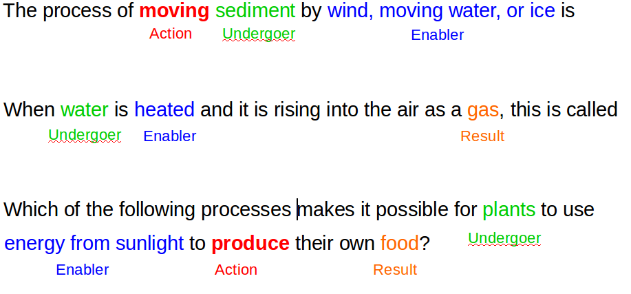

# Semantic Role Extractor for Scientific Processes

### Summary
The goal of this project is extract semantic knowledge from scientific processes (e.g. photosynthesis, evaporation, condensation etc) from natural language text.
We want to discover entities, actions that are essential for these processes in order to build a knowledge base that can help downstream application such as Question Answering task, namely standardized 4thgrade standardized science exams such as [NY Regent Exam](http://www.nysedregents.org/Grade4/Science/home.html).

1. We extend the existing Semantic Role Labeling system, namely ClearParser (by Jinho Choi) to incorporate a domain adaptation technique. The domain adaptation technique that we used
   is described in details in Hal Daume III's paper [Frustratingly Easy Domain Adaptation](http://www.umiacs.umd.edu/~hal/docs/daume07easyadapt.pdf)
   This work is published in [KCAP 2015 Science Knowledge Workshop] (http://www.isi.edu/ikcap/sciknow2015/papers/Louvan.pdf)

2. We develop another system which uses the redundancy of the web. We gathered sentences with specific construct that is expected to contain a particular semantic roles. After that
   we build a classifier that uses various lexical, syntactical, and semantic features to extract argument span in the sentence that represent certain semantic roles.

Example:

